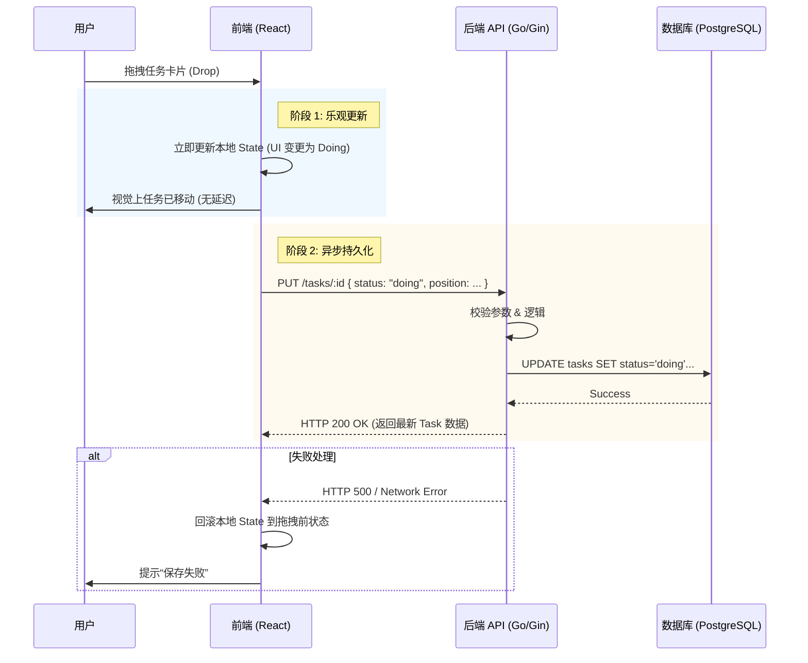

# Kanban Board 架构设计文档

**版本**: 1.0.0  
**日期**: 2026-01-19  
**技术栈**: React (TS) + Go (Gin) + PostgreSQL + Docker

---

## 1. 架构概览与职责划分

本系统采用经典的前后端分离架构，通过 RESTful API 进行通信，所有服务容器化部署。

### 1.1 前端层 (Frontend)
- **技术选型**: React, TypeScript, Vite, Dnd-Kit (或同类库), Axios.
- **核心职责**:
  - **视图交互**: 负责 Kanban 泳道（Todo/Doing/Done）的渲染与拖拽交互体验。
  - **状态管理**: 维护当前看板的内存快照，确保拖拽流畅度。
  - **乐观更新 (Optimistic UI)**: 用户拖拽时，**先立即在界面上反馈移动结果**，再异步发送 API 请求。如果请求失败，则回滚状态，保证极致的用户体验。
  - **数据适配**: 将后端返回的扁平数据结构转换为前端看板所需的分组结构。

### 1.2 后端层 (Backend)
- **技术选型**: Go, Gin Web Framework, GORM (或 sqlx).
- **核心职责**:
  - **API 网关**: 提供标准的 RESTful 接口 (GET /tasks, PUT /tasks/:id/move 等)。
  - **业务逻辑**: 处理任务状态流转规则（如：只允许合法状态变更）。
  - **数据清洗**: 校验请求参数合法性。
  - **错误处理**: 对数据库异常、逻辑异常返回统一的错误码。

### 1.3 数据层 (Database)
- **技术选型**: PostgreSQL.
- **核心职责**:
  - **持久化**: 可靠存储任务数据。
  - **完整性约束**: 利用 SQL 约束保证数据的准确性（如枚举状态值）。
  - **事务管理**: 保证复杂操作的原子性（如批量排序更新）。

---

## 2. 核心数据流 (Data Flow)

以“**用户将任务从 Todo 拖拽到 Doing**”场景为例：

---

## 3. 架构分层决策理由

1.  **前后端分离**: 
    - 允许前端专注于复杂的拖拽动画和交互逻辑，而不受后端模板渲染限制。
    - Go 后端作为纯 API 服务，性能极高，且天然支持并发，适合未来扩展。
    
2.  **Go + Gin**:
    - **极简**: 符合“不要过度设计”原则，Gin 极其轻量，启动快，资源占用低。
    - **强类型**: 与前端 TypeScript 形成互补，利用 JSON Tag 保证契约严谨。

3.  **Docker Compose**:
    - **开发一致性**: 消除“我本地能跑”的问题，统一前后端和数据库的运行环境。
    - **部署便捷**: 一个 `docker-compose up` 即可拉起完整环境。

---

## 4. 后续扩展规划 (Scalability)

本架构设计预留了以下扩展接口，当前 MVP 阶段暂不实现，但结构上已准备就绪：

### 4.1 多用户与权限系统 (Auth)
- **现状**: 当前无用户概念，所有此时面向单一面板。
- **扩展**: 
  - 在 DB `tasks` 表中增加 `user_id` 或 `team_id` 字段。
  - Gin 中间件层增加 JWT 校验 (`AuthMiddleware`)。
  - 前端增加 Login 页和 Token 存储。

### 4.2 实时协作 (Real-time Collaboration)
- **现状**: 数据刷新依赖手动或 Polling。
- **扩展**:
  - 使用 Go 的 Goroutine + Chan 轻松实现 WebSocket Hub。
  - 当 API 收到 `UPDATE` 请求成功后，通过 WebSocket 广播 `TASK_MOVED` 事件给其他在线客户端。
  - 前端监听 WS 事件自动更新 State，实现多人同时操作看板。

### 4.3 任务排序 (Ranking)
- **现状**: 简单列表。
- **扩展**:
  - 引入 `NexRank` 或 `Lexorank` 算法（使用字符串或浮点数索引）来处理拖拽排序，避免每次拖拽都需要重写大量 rows 的 `order_index`。
